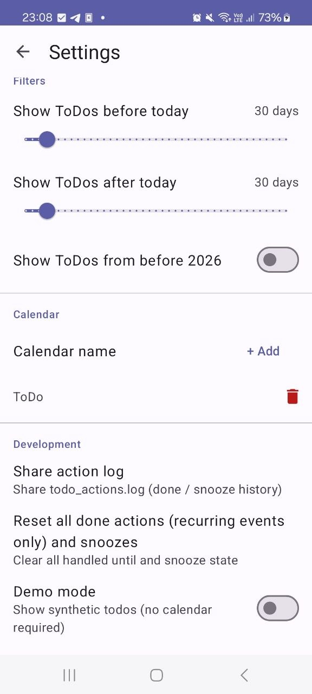

# Todo Notifications

An Android app that reads events from a DAVx5-synced **"ToDo" calendar** and displays them as **persistent notifications** in the notification shade. In case they get swiped away by accident, they will show up after some seconds.

<video src="screenshots/swipe-away-restore.mp4" autoplay loop muted playsinline></video>

## Features

- Reads todos from the Android calendar (DAVx5 "ToDo" calendar, configurable)
- One notification card per todo
- Notifications are restored automatically within ~3 seconds if dismissed
- Tap a notification card to open the event in [Business Calendar 2](https://play.google.com/store/apps/details?id=com.appgenix.bizcal) (fallback: system calendar)
- **Delete** a todo directly from the notification card ("Delete" action button) or from the app's list view
- Filters (via **⋮ overflow menu → Settings**):
  - **Show ToDos from <2026** toggle
  - **Show ToDos within ±1 week** toggle
  - **Show ToDos within ±1 month** toggle
- **Demo mode** (via Settings → Development) — shows synthetic dummy todos (no calendar required)
- Notifications update automatically when the calendar changes

## Screenshots

| App list view | Settings | Notifications (collapsed) | Notifications (expanded) |
|:---:|:---:|:---:|:---:|
|  |  |  |  |

## How notification persistence works

- A **foreground service** (`TodoForegroundService`) keeps a summary notification alive permanently.
- Individual per-todo notifications use `setOngoing(true)` but can be dismissed on Android 14+.
- A **watchdog** runs every 3 seconds: it checks `NotificationManager.getActiveNotifications()` and reposts any missing individual notifications via `nm.notify()`.
- To avoid Android's notification rate-limiting, individual notifications are posted with a 250 ms stagger between each.
- On device reboot, `BootReceiver` starts `TodoForegroundService`. `startForeground()` is called immediately in `onStartCommand()` before any calendar query, satisfying Android's 5-second foreground service deadline even when the calendar ContentProvider is slow to become available at boot.

## Requirements

- **Android 8.0+ (API 26+)**
- Android SDK with Build Tools 34 (installed automatically by `build.sh`, or via Android Studio)
- JDK 17+ (for `build.sh`)
- DAVx5 with a calendar named exactly **"ToDo"** synced to the device

## Settings

Accessible via the **⋮ overflow menu → Settings** and the **About** item in the toolbar.

**Filters**

| Setting | Description |
|---|---|
| Show ToDos from <2026 | Include events with a start date before 2026 |
| Show ToDos within ±1 week | Narrow the list to events within 7 days of today |
| Show ToDos within ±1 month | Narrow the list to events within 30 days of today |

Only one time-range filter can be active at a time; enabling one clears the others.

**Calendar**

| Setting | Description |
|---|---|
| Calendar name | Display name of the Android calendar to read todos from (case-sensitive, default: `ToDo`) |

**Development**

| Setting | Description |
|---|---|
| Demo mode | Show synthetic dummy todos — no calendar required (useful for screenshots/testing) |

## Installation

1. Download the latest APK from the [Releases](https://github.com/caco3/Persistent-ToDo-Notifications/releases) page.
2. On your device, enable **Install from unknown sources** (Settings → Apps → Special app access) if not already allowed.
3. Open the downloaded `.apk` to install.
4. Grant **Calendar** and **Notification** permissions when prompted.

## Development

### Option A — Android Studio

1. **Open in Android Studio:** `File → Open → select the TodoNotifications folder`
2. **Sync Gradle:** click "Sync Now" when prompted.
3. **Build and run** on a device or emulator (API 26+).
4. **Grant permissions** when prompted: Calendar (read + write) and Notifications.

> `local.properties` is generated automatically by Android Studio. Do not commit it.

### Option B (Linux) — `build.sh` (no Android Studio required)

`build.sh` downloads all required SDK components and builds the APK entirely from the command line.

**Prerequisites:** `java` (JDK 17+), `curl`, `unzip`

```bash
# Build debug APK
./build.sh

# Build and immediately flash to a connected device via adb
./build.sh -f
```

What the script does (each step is skipped on subsequent runs if already done):

1. Downloads Android command-line tools → `~/android-sdk`
2. Accepts SDK licences
3. Installs `platforms;android-34`, `build-tools;34.0.0`, `platform-tools`
4. Downloads Gradle 8.4 → `~/.gradle-dist/gradle-8.4`
5. Generates a `./gradlew` wrapper for future manual use
6. Writes `local.properties` pointing to the SDK
7. Builds `app/build/outputs/apk/debug/*.apk`

With `-f`, the script also runs `adb install -r <apk>` to flash the built APK onto a connected device or emulator.

## Project Structure

```
build.sh                              # CLI build + flash script (no Android Studio needed)
app/src/main/
├── java/com/example/todonotifications/
│   ├── TodoItem.kt                   # Data class (id, title, dtStart, isRecurring)
│   ├── CalendarTodoSource.kt         # Reads events from the "ToDo" calendar
│   ├── AppPreferences.kt             # SharedPreferences for filter/settings toggles
│   ├── NotificationHelper.kt         # Builds summary + per-todo notifications
│   ├── NotificationActionReceiver.kt # Handles ACTION_REPOST and ACTION_DELETE_TODO
│   ├── TodoForegroundService.kt      # Foreground service + 3s watchdog
│   ├── BootReceiver.kt               # Restarts service after reboot
│   ├── MainActivity.kt               # Main UI (list, overflow menu)
│   ├── SettingsActivity.kt           # Settings screen (filters, demo mode)
│   └── TodoAdapter.kt                # RecyclerView adapter
└── res/
    ├── layout/
    │   ├── activity_main.xml
    │   ├── activity_settings.xml
    │   └── item_todo.xml
    ├── menu/
    │   └── menu_main.xml             # Overflow menu items
    ├── values/
    │   ├── strings.xml
    │   ├── themes.xml
    │   └── colors.xml
    └── drawable/                     # Vector icons
```

## Permissions Used

| Permission | Purpose |
|---|---|
| `READ_CALENDAR` | Read events from the "ToDo" calendar |
| `WRITE_CALENDAR` | Delete events from app / notification |
| `POST_NOTIFICATIONS` | Show notifications (required at runtime on Android 13+) |
| `RECEIVE_BOOT_COMPLETED` | Restart notification service after reboot |
| `FOREGROUND_SERVICE` | Keep the summary notification alive |
